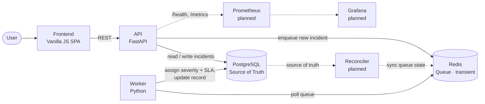
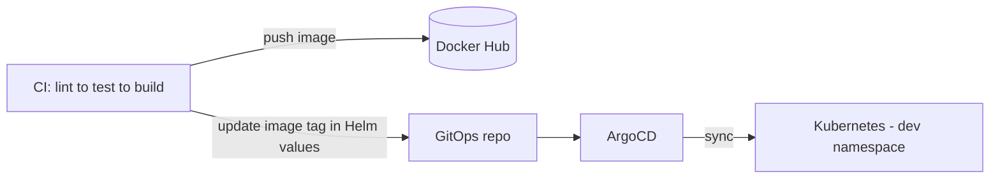

# Incident Management Platform

> A cloud-native, microservices-based incident management system, built as a hands-on
> portfolio project to demonstrate end-to-end DevOps practices: containerization,
> Kubernetes orchestration, GitOps continuous delivery, CI/CD, observability, and
> Infrastructure-as-Code.

---

## Table of Contents
- [Overview](#overview)
- [Architecture](#architecture)
- [Tech Stack](#tech-stack)
- [How It Works](#how-it-works)
- [Repository Structure](#repository-structure)
- [Running Locally (Docker Compose)](#running-locally-docker-compose)
- [Kubernetes Deployment (Helm + ArgoCD)](#kubernetes-deployment-helm--argocd)
- [CI/CD Pipeline](#cicd-pipeline)
- [Project Status & Roadmap](#project-status--roadmap)
- [Design Decisions](#design-decisions)

---

## Overview

This project is a small but realistic distributed system: users create incidents through a
web UI, an API persists them, and a background worker asynchronously enriches each incident
with a severity level and an SLA deadline. The application itself is intentionally simple —
its purpose is to serve as a vehicle for demonstrating the operational tooling and delivery
practices built *around* it.

The focus of this project is the infrastructure and delivery layer, not the business logic.

---

## Architecture

The system is composed of four services and two backing stores. **PostgreSQL is the single
source of truth** for all incident state; **Redis is treated as a disposable, transient
queue** that holds no authoritative data and can be rebuilt from PostgreSQL.

- **Frontend** — a single-page vanilla-JS app to create, view, and delete incidents.
- **API** — a FastAPI service exposing incident CRUD endpoints plus `/health` and `/metrics`.
- **Worker** — a Python service that consumes incidents from the queue and processes them.
- **PostgreSQL** — the single source of truth for all incident state.
- **Redis** — a transient work queue connecting the API and the worker; it stores no
  authoritative state and can be reconstructed from PostgreSQL by the reconciler *(planned)*.

---

## Tech Stack

| Layer            | Technology                          |
|------------------|-------------------------------------|
| API              | Python, FastAPI                     |
| Frontend         | Vanilla JavaScript (SPA)            |
| Worker           | Python                              |
| State            | PostgreSQL                          |
| Queue            | Redis                               |
| Containerization | Docker, Docker Compose              |
| Orchestration    | Kubernetes, Helm                    |
| GitOps / CD      | ArgoCD                              |
| CI               | GitHub Actions                      |
| Registry         | Docker Hub                          |
| Observability    | Prometheus, Grafana *(planned)*     |
| IaC / Cloud      | Terraform, AWS *(planned)*          |

---

## How It Works

1. A user creates an incident through the frontend, which calls the API.
2. The API writes the incident to PostgreSQL and enqueues a processing job in Redis.
3. The worker polls the Redis queue, picks up the incident, and computes its **severity**
   and **SLA deadline**.
4. The worker writes the enriched data back to PostgreSQL.
5. The frontend reflects the updated incident on the next read.

This separation lets the API stay fast and responsive while heavier processing happens
asynchronously in the worker — a common pattern for decoupling user-facing requests from
background work.

---

## Kubernetes Deployment (Helm + ArgoCD)

The application is deployed to Kubernetes using **Helm** charts, with **ArgoCD** providing
GitOps-based continuous delivery. Rather than pushing changes to the cluster imperatively,
the desired state is declared in Git, and ArgoCD continuously reconciles the cluster to
match it.

<!-- TODO: add the actual commands / steps to bootstrap, e.g. installing the ArgoCD
     Application manifest, namespace setup, secrets, etc. -->

---

## CI/CD Pipeline

Each of the three services has its own CI pipeline. On a change, the pipeline runs the
following stages in order:

1. **Lint** — static analysis and style checks.
2. **Unit test** — run the service's unit test suite.
3. **Build** — build the service's Docker image.
4. **Push** — push the tagged image to Docker Hub.
5. **Update Helm values** — bump the image tag in the Helm values file in the GitOps repo.

ArgoCD detects the change to the Helm values and automatically syncs the new image into the
**dev** namespace — no manual `kubectl` steps. This gives a fully automated path from code
change to a running deployment in dev.

---

## Project Status & Roadmap

**Legend:** ✅ done · 🚧 in progress · ⬜ planned

### Phase 1 — Core Application ✅
- ✅ FastAPI API with create / delete / get-all incident endpoints
- ✅ `/health` and `/metrics` endpoints scaffolded *(metrics not yet emitting data)*
- ✅ Vanilla JS frontend (create / view / delete incidents)
- ✅ PostgreSQL for state, Redis for the queue
- ✅ Worker that assigns severity + SLA deadline and updates state
- ✅ Full local stack via Docker Compose

### Phase 2 — Continuous Integration ✅
- ✅ Per-service CI pipelines that build and push images to Docker Hub
- ✅ Automated update of `values.yaml` in the GitOps repo

### Phase 3 — Kubernetes + GitOps 🚧
- 🚧 Helm charts / Kubernetes manifests for all services
- 🚧 ArgoCD auto-sync to the dev namespace

### Phase 4 — Environment Promotion ⬜
- ⬜ Promotion pipeline: dev → staging → prod

### Phase 5 — Observability ⬜
- ⬜ Real Prometheus metrics from the API and worker (`/metrics`)
- ⬜ Grafana dashboards for key signals (request rate, queue depth, processing latency)

### Phase 6 — Cloud + Infrastructure-as-Code ⬜
- ⬜ Provision equivalent infrastructure on AWS with Terraform

### Phase 7 — Resilience & State Reconciliation ⬜
- ⬜ Reconciler that keeps Redis in sync with PostgreSQL (the source of truth), so the
  transient queue can be rebuilt automatically if Redis is restarted or loses data

---

## Design Decisions

- **Why a queue + worker instead of processing inline in the API?**
  Decoupling, responsiveness, mirrors real async processing patterns.
- **Why GitOps / ArgoCD instead of pushing deployments from CI?**
  Git as single source of truth, auditability, declarative reconciliation.
- **Why Helm?**
  Templating across environments, reuse, values-per-environment
- **Why treat Redis as disposable, with PostgreSQL as the single source of truth?**
  Resilience to Redis restarts or data loss via a reconciler that re-derives queue state from PG.

---

<!-- Optional but powerful: add a "Screenshots" or "Demo" section with images of the UI,
     the ArgoCD dashboard, and (later) your Grafana dashboards. Visual proof carries weight. -->
